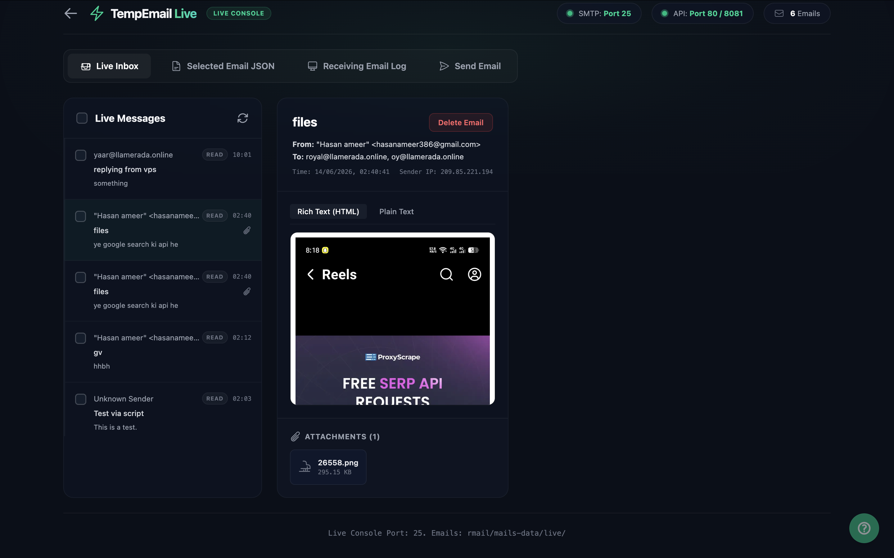
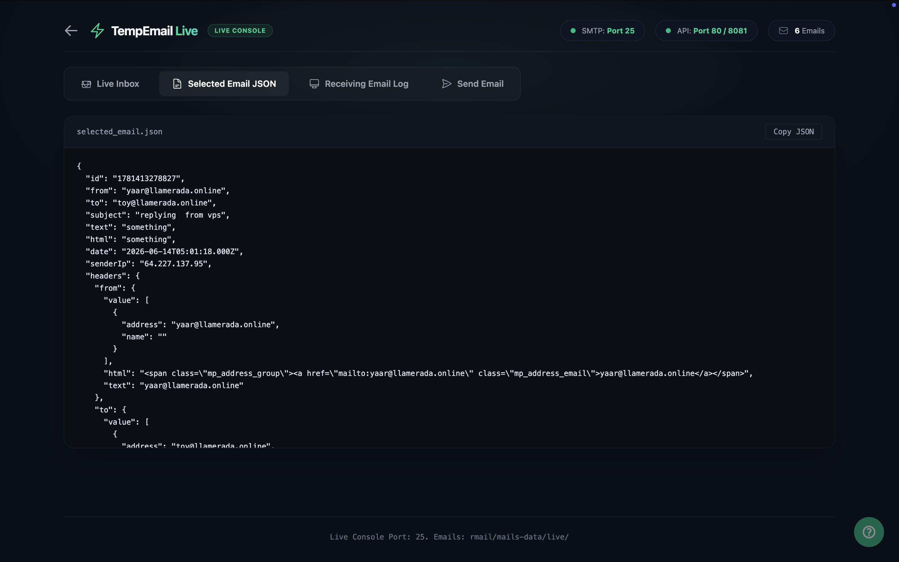
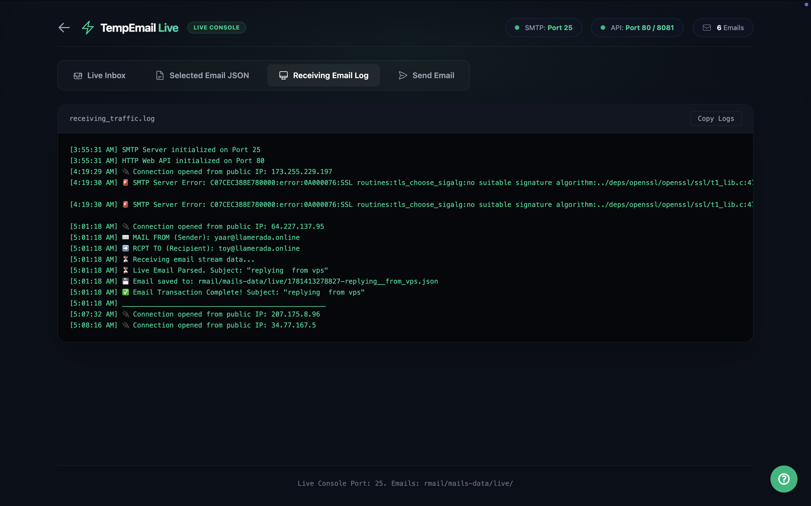
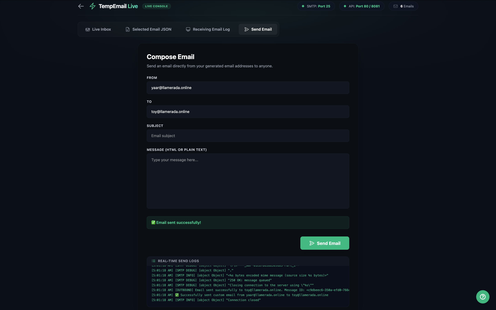
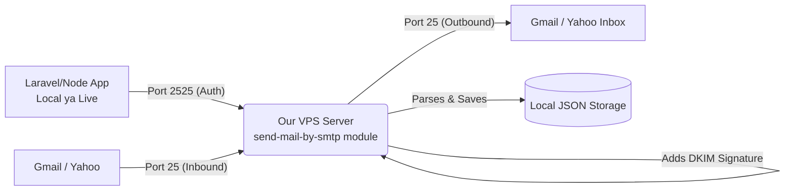
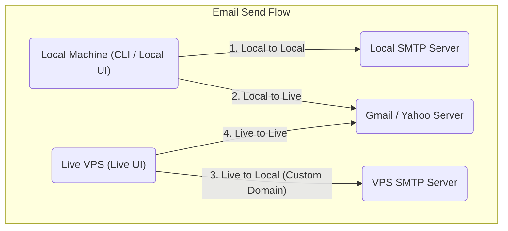
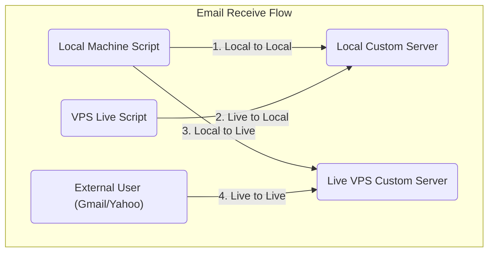

# Temp Email System (Custom Email Server)

Yeh ek custom email server application hai jo aapko apni custom domain (jaise `llamerada.online`) par emails bhejney aur wasool (receive) karne ki poori saholat deti hai. Yeh system **Local development** aur **Live VPS** dono environments mein theek tarah se kaam karne ke liye design kiya gaya hai.

## 🚀 Features (Khusoosiyat)

- **Send Emails:** Aap kisi bhi public email address (Gmail, Yahoo) ya custom domain par email bhej sakte hain.
- **Receive Emails:** Apni custom domain par aane wali tamam emails ko live receive aur read kar sakte hain.
- **4-Way Email Flow:**
  - `Local to Local`
  - `Local to Live`
  - `Live to Local`
  - `Live to Live`
- **Direct IP Sending/Receiving:** Baghair domain ke direct IP address (e.g. `user@[64.227.137.95]`) use kar ke bhi email send ya receive ki ja sakti hai.
- **Spam Prevention:** SPF aur DMARC records ke zariye emails ko spam mein jane se bachane ka mukammal intezam.

---

## 📸 Console Screenshots (Dashboard Preview)

Aap neechay diye gaye screenshots se is custom email dashboard aur console interface ka preview dekh sakte hain:

### 1. Main Home Dashboard


### 2. Local Console Dashboard


### 3. Inbound / Outbound SMTP Logs


### 4. Outbound SMTP Credentials / Relay Logs


### 5. Email Rich Text / Raw JSON Viewer


---

## 🏗️ Architecture Flow (Kaam Kaise Karta Hai?)



---

## 📊 Current Port Usage (Kaunsi Port Kahan Use Hoti Hai?)

### 🔴 Live Environment (`live=true`)
| Service | Port | Description |
|---------|------|-------------|
| **Web Dashboard (UI)** | `80` (or `8080`) | Live browser interface chalane ke liye. |
| **Receive Email (Inbound)** | `25` | Gmail/Yahoo se standard emails receive karne ke liye. |
| **Send Email (Outbound)** | `25` | Hamare code se internet par emails bhejne ke liye. |
| **External App Relay (Auth)** | `2525` | `send-mail-by-smtp` server ke zariye 3rd party apps (Node/PHP) ko connect karne ke liye. |

### 🔵 Local Environment (`live=false`)
| Service | Port | Description |
|---------|------|-------------|
| **Web Dashboard (UI)** | `8081` | Local development interface (taake port 80 se conflict na ho). |
| **Receive Email (Inbound)** | `2525` | Local machines aam taur par port 25 block karti hain, isliye local par 2525 use hoti hai. |
| **Send Email (Outbound)** | `25` | Local testing ke doran bhi hamara code port 25 par hi send karne ki koshish karta hai. |
| **External App Relay (Auth)** | `2525` | `send-mail-by-smtp` server ke zariye external apps connect karne ke liye. |

---

## 📚 Documentation & Guides
Is project ke har hisse ko tafseel se samajhne ke liye alag alag guides banayi gayi hain taake naye developers ko asani ho. Aap neechay diye gaye links par click kar ke unhe parh sakte hain:

1. 📖 **[VPS Setup Guide](./doc-flow/vps-setup.md)**
   - Naye VPS par Node.js, PM2 install karne aur is project ko live karne ka poora tariqa.
2. 🛡️ **[Spam Prevention Guide](./doc-flow/spam-prevention-guide.md)**
   - Emails ko reject ya spam hone se bachane ke liye SPF aur DMARC records lagane ka tariqa.
3. 📤 **[Send Email Flow](./doc-flow/send-mail-flow.md)**
   - Email bhejne ka mukammal flow, zaroori packages, port requirements, aur mukhtalif scenarios.
4. 📥 **[Receive Email Flow](./doc-flow/receive-mail-flow.md)**
   - Email receive karne ka flow, DNS (A aur MX) records, aur zaroori packages ki tafseel.
5. 🌐 **[Protocols & DNS Records Guide](./doc-flow/protocols.md)**
   - Tamam zaroori protocols (A, MX, TXT, SPF, DMARC, DKIM, SMTP) ki mukammal tafseel aur unhe implement karne ka tariqa.
6. 🔌 **[Outbound SMTP Server Guide (send-mail-by-smtp)](./doc-flow/send-mail-by-smtp-flow.md)**
   - Kisi bhi naye project (e.g., PHP, Node.js) mein is mail server ko attach karne ka tariqa, credentials, aur Port 2525 connection flow.
7. 🚪 **[Ports Guide](./doc-flow/ports.md)**
   - Kaunsi port (25, 2525, 80, 8081) kis maqsad ke liye (Live VPS, Local Machine, Client App) istemal hoti hai, uski mukammal tafseel.

---

## 📊 Flow Diagrams (System Kaise Kaam Karta Hai)

Neechay diye gaye diagrams mein Email Send aur Receive karne ke tamam flows wazeh kiye gaye hain.

### 📤 1. Email Sending Flow Diagram


### 📥 2. Email Receiving Flow Diagram


---

## 🛠️ Quick Start (Run Kaise Karein?)

Agar aap is project ko apne paas run karna chahte hain toh yeh commands chalayen:

```bash
# 1. Packages install karein
bun install

# 2. Frontend Astro app ko build karein
bun run build

# 3. Email Server aur Backend API start karein
bun run mail:start
```

---

## 🚫 Forbidden IDs API (Project-Specific)

Agar aap nahi chahte ke kuch specific email usernames (jaise `admin`, `info`, `support`) generate hon, toh aap **Forbidden IDs** set kar sakte hain. Yeh settings **har project ke liye alag (per project)** kaam karti hain. Isme **Free** aur **Pro** users ke liye alag-alag forbidden IDs set karne ki saholat mojud hai.

### 1. Fetch Forbidden IDs
- **Endpoint:** `GET /api/project/forbidden-ids`
- **Headers:** `Authorization: Bearer <Your-Project-API-Key>`
- **Response Example (200 OK):**
```json
{
  "forbiddenIds": {
    "free": ["admin", "info", "support", "contact", "mail", "office", "user"],
    "pro": ["admin", "support", "info"]
  }
}
```

### 2. Update Forbidden IDs
- **Endpoint:** `PUT /api/project/forbidden-ids`
- **Headers:** 
  - `Authorization: Bearer <Your-Project-API-Key>`
  - `Content-Type: application/json`
- **Request Body Example:**
```json
{
  "forbiddenIds": {
    "free": ["admin", "info", "support", "contact", "ceo"],
    "pro": ["admin", "support"]
  }
}
```
- **Response Example (200 OK):**
```json
{
  "success": true,
  "forbiddenIds": {
    "free": ["admin", "info", "support", "contact", "ceo"],
    "pro": ["admin", "support"]
  }
}
```

### 3. Usage with Custom Email Generation
Jab aap custom email generate karte hain, URL mein `?plan=pro` ya `?plan=free` pass karein (default: `free`):
- **Request:** `GET /api/mailbox/custom?name=admin&domain=llamerada.online&plan=free`
- **Response Error (403 Forbidden):**
```json
{
  "error": "Username 'admin' is forbidden on free plan for this project"
}
```

---

## 📁 Allowed File Extensions API (Project-Specific)

System mein aane wale email attachments kin file extensions (`.png`, `.pdf`, `.zip`, etc.) ke honay chahiye, isko **Free** aur **Pro** users ke liye alag-alag restrict kiya ja sakta hai.

### 1. Fetch Allowed File Extensions
- **Endpoint:** `GET /api/project/allowed-files`
- **Headers:** `Authorization: Bearer <Your-Project-API-Key>`
- **Response Example (200 OK):**
```json
{
  "allowedFiles": {
    "free": ["txt", "png", "jpg", "jpeg", "pdf", "zip"],
    "pro": ["txt", "sql", "png", "zip", "pdf", "ai", "mp3", "mp4", "jpg", "jpeg", "gif"]
  }
}
```

### 2. Update Allowed File Extensions
- **Endpoint:** `PUT /api/project/allowed-files`
- **Headers:** 
  - `Authorization: Bearer <Your-Project-API-Key>`
  - `Content-Type: application/json`
- **Request Body Example:**
```json
{
  "allowedFiles": {
    "free": ["txt", "png", "jpg", "pdf"],
    "pro": ["txt", "sql", "png", "jpg", "pdf", "zip", "mp4", "doc", "docx"]
  }
}
```
- **Response Example (200 OK):**
```json
{
  "success": true,
  "allowedFiles": {
    "free": ["txt", "png", "jpg", "pdf"],
    "pro": ["txt", "sql", "png", "jpg", "pdf", "zip", "mp4", "doc", "docx"]
  }
}
```

---

## ⏰ Email Age Settings API (Project-Specific in Hours)

Emails aur temporary mailbox records kitne **Hours (ghante)** tak server par rehne chahiye unki auto-cleanup limit set karne ke liye. (0 ka matlab: hamesha ke liye save rakhein).

### 1. Fetch Email Age Settings
- **Endpoint:** `GET /api/project/retention`
- **Headers:** `Authorization: Bearer <Your-Project-API-Key>`
- **Response Example (200 OK):**
```json
{
  "retention": {
    "free": {
      "generated_emails": 24,
      "simple_mails": 24,
      "attachments": 12
    },
    "pro": {
      "generated_emails": 720,
      "simple_mails": 720,
      "attachments": 720
    }
  }
}
```

### 2. Update Retention Settings
- **Endpoint:** `PUT /api/project/retention`
- **Headers:** 
  - `Authorization: Bearer <Your-Project-API-Key>`
  - `Content-Type: application/json`
- **Request Body Example (Limits in Hours):**
```json
{
  "retention": {
    "free": {
      "generated_emails": 24,
      "simple_mails": 12,
      "attachments": 6
    },
    "pro": {
      "generated_emails": 720,
      "simple_mails": 360,
      "attachments": 168
    }
  }
}
```
- **Response Example (200 OK):**
```json
{
  "success": true,
  "retention": {
    "free": {
      "generated_emails": 24,
      "simple_mails": 12,
      "attachments": 6
    },
    "pro": {
      "generated_emails": 720,
      "simple_mails": 360,
      "attachments": 168
    }
  }
}
```

---

## 🔑 Mailbox Logins / Users API

Transient Mailbox User credentials create, read, update, aur delete karne ke endpoints:

### 1. Fetch Mailbox Logins List
- **Endpoint:** `GET /api/admin/mailbox-users`
- **Headers:** `Authorization: Bearer <Admin-Token>`
- **Response Example (200 OK):**
```json
[
  {
    "id": 1,
    "email": "john@llamerada.online",
    "plain_password": "Pass1234!",
    "project_id": 1,
    "project_name": "Main Project",
    "received_count": 5,
    "created_at": "2026-07-30T16:00:00.000Z"
  }
]
```

### 2. Create Mailbox Login
- **Endpoint:** `POST /api/admin/mailbox-users`
- **Headers:** `Authorization: Bearer <Admin-Token>`, `Content-Type: application/json`
- **Body Example:**
```json
{
  "email": "john@llamerada.online",
  "password": "Pass1234!",
  "project_id": 1
}
```

### 3. Update Mailbox Password
- **Endpoint:** `PUT /api/admin/mailbox-users/:id`
- **Headers:** `Authorization: Bearer <Admin-Token>`, `Content-Type: application/json`
- **Body Example:**
```json
{
  "password": "NewSecretPassword123!",
  "project_id": 1
}
```

### 4. Delete Mailbox Login
- **Endpoint:** `DELETE /api/admin/mailbox-users/:id`
- **Headers:** `Authorization: Bearer <Admin-Token>`
